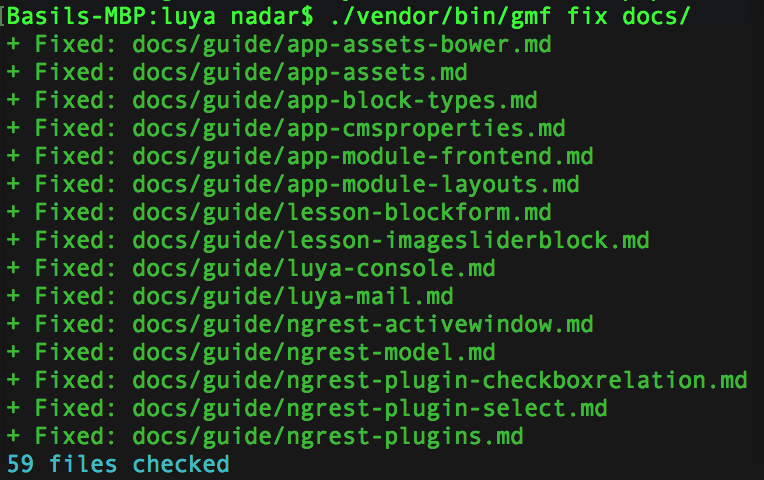

# GitHub Markdown Fixer

[](https://luya.io)
[](https://packagist.org/packages/nadar/github-markdown-fixer)
[](https://packagist.org/packages/nadar/github-markdown-fixer)

This project fixes your markdown files in order to have render them nicly withing GitHub.

+ Replace all tabs with 4 spaces.
+ Find Breaking Spaces and replace them with normal spaces. [GitHub Markdown Renderer problems with Breaking Spaces](https://github.com/github/markup/issues/1054#issuecomment-300061967).



## Usage

Add ths github markdown fixer to your project, within the `require-dev` section:

> IF YOU GET A MINIMUM STABILITY / COMPOSER ERROR USE: `"minimum-stability" : "RC"` IN YOUR COMPOSER.JSON.

```sh
composer require nadar/github-markdown-fixer --dev
```

Go into your Terminal an run the Fixer:

```sh
./vendor/bin/gmf fix /folder
```

### Options

|argument|description
|--------|----------
|--dry	 |run command in dry mode, does not change file contents.